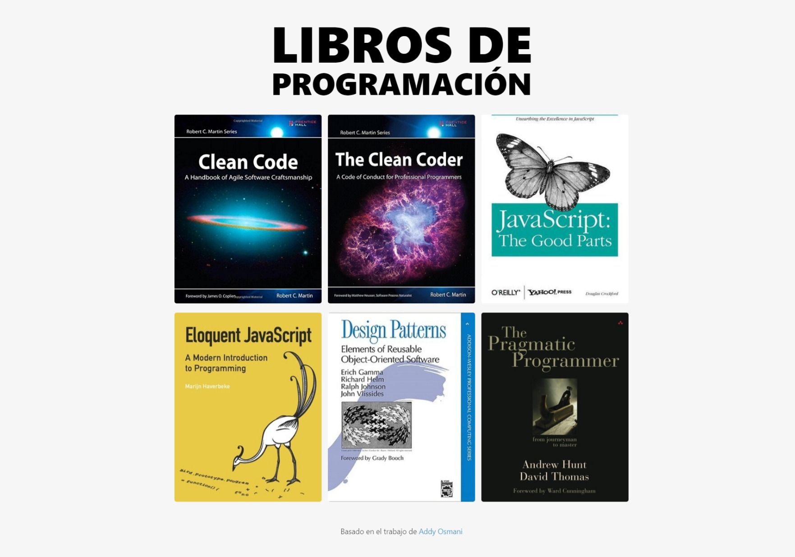
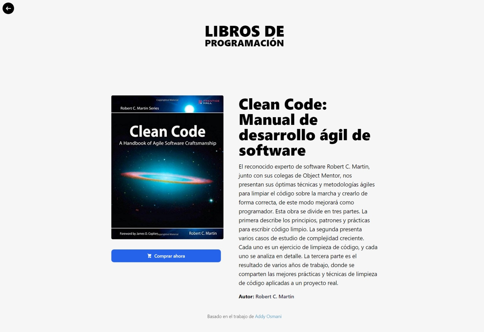

# Astro & View Transitions API
Página web interactiva construida con Astro. Presenta una biblioteca de libros con transiciones suaves entre las páginas gracias a la View Transition API. Cada libro tiene su propia página con detalles como el título, un comentario y el autor. El proyecto también utiliza Tailwind CSS.

## Tecnologías
Esta página web fue realizada con las siguientes tecnologías:
- HTML5
- CSS3
- JavaScript
- Astro
- Tailwind CSS
- Netlify

## Páginas
Este proyecto contiene 2 páginas: **Inicio** y **Libro**.

### Inicio
#### En la página de inicio, se presenta una selección de libros de programación, cada uno con su propia página de detalles accesible con un solo clic.

### Libro
#### Al seleccionar un libro, serás redirigido a una página detallada que resalta aspectos clave del libro seleccionado, incluyendo el título, un comentario y la información del autor. Además, se ha incorporado un botón de navegación en la esquina superior izquierda que permite un retorno fácil y rápido a la página de inicio. Lo más destacado es la transición fluida entre las páginas, que proporciona una experiencia de usuario sin interrupciones.

